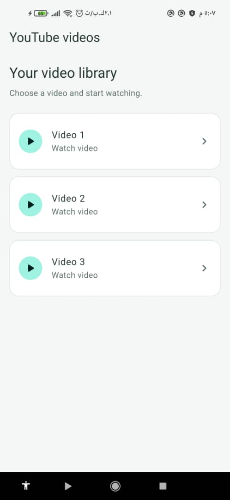
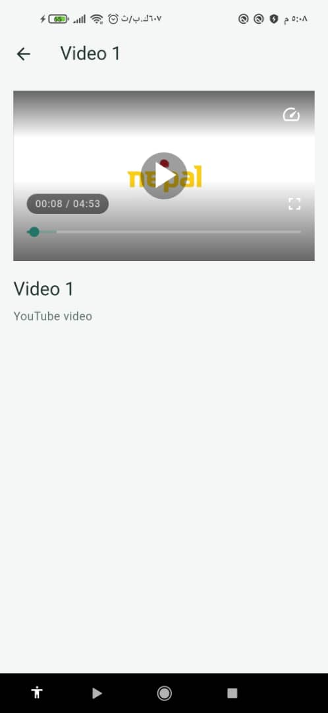

# YouTube Videos — Flutter

تطبيق Flutter بسيط لعرض مكتبة فيديوهات ومشاهدتها داخل التطبيق، أنجزته ضمن **Flutter Training Bootcamp** التابع لأكاديمية **CS Academy**.

كان المشروع تطبيقًا عمليًا على استخدام مكتبة `video_player` والتعامل مع تشغيل الفيديو في Flutter. تستخدم النسخة الحالية مكتبة `youtube_player_flutter` لتشغيل فيديوهات YouTube المضمّنة، مع وجود `video_player` ضمن اعتماديات المشروع.

## صور التطبيق

<table>
  <tr>
    <th>مكتبة الفيديوهات</th>
    <th>شاشة تشغيل الفيديو</th>
  </tr>
  <tr>
    <td></td>
    <td></td>
  </tr>
</table>

## المميزات

- عرض الفيديوهات في قائمة بسيطة وواضحة.
- فتح شاشة مستقلة للفيديو المختار وعرض عنوانه.
- تشغيل الفيديو وإيقافه مؤقتًا والتحكم في موضع المشاهدة.
- إتاحة زر ملء الشاشة داخل المشغّل.
- العودة من شاشة المشاهدة إلى مكتبة الفيديوهات.
- عرض رسالة عند تعذّر تشغيل الفيديو.

## ما تعلّمته

- دمج مكتبات تشغيل الفيديو في تطبيق Flutter.
- التعامل مع متحكّم الفيديو وتهيئته وتحرير موارده عند إغلاق الشاشة.
- تمرير بيانات الفيديو بين الشاشات باستخدام التنقّل المسمّى.
- تنظيم الكود إلى بيانات وواجهات، وفصل إعدادات التنقّل والثيم.
- استخدام معرّف فيديو YouTube دون معاملات الرابط الإضافية.

## التقنيات المستخدمة

| التقنية | الاستخدام |
| --- | --- |
| Flutter وDart | بناء التطبيق والواجهات |
| Material Design | البطاقات والأزرار وعناصر الواجهة |
| `video_player` | المكتبة التي تناولها التطبيق العملي في التدريب، والمضافة ضمن الاعتماديات |
| `youtube_player_flutter` | تشغيل فيديوهات YouTube في الواجهة الحالية |
| `flutter_test` | اختبار الواجهات والتنقّل |

## تشغيل المشروع

يلزم تثبيت Flutter بإصدار يتضمن Dart متوافقًا مع `^3.10.4`، وتجهيز هاتف أو محاكي Android، وتوفير اتصال بالإنترنت لتحميل الفيديوهات.

من مجلد المشروع:

```bash
flutter pub get
flutter devices
flutter run -d <device-id>
```

استبدل `<device-id>` بمعرّف الجهاز الذي يظهر في نتيجة `flutter devices`.

للتشغيل في Chrome:

```bash
flutter run -d chrome
```

شاشة الفيديو الحالية مهيّأة لـ Android وiOS وmacOS والويب. عند تشغيل التطبيق على Windows أو Linux، تعرض الشاشة رسالة توضيحية بدل المشغّل.

## إضافة فيديوهات

عدّل القائمة في [`lib/features/videos/data/data_list.dart`](lib/features/videos/data/data_list.dart)، وأضف اسم الفيديو ومعرّفه فقط:

```dart
VideoItem(
  name: 'Video 1',
  id: 'QvP9kZs3MJI',
),
```

في رابط مثل `https://www.youtube.com/watch?v=QvP9kZs3MJI`، يكون المعرّف هو `QvP9kZs3MJI`. لا تُضف إليه معاملات قائمة التشغيل مثل `&list=...` أو `&index=...`.

## هيكل المشروع

```text
lib/
├── main.dart                         # نقطة تشغيل التطبيق
├── e_learning.dart                   # إعداد التطبيق
├── core/
│   ├── constants/                    # النصوص والثوابت
│   ├── dependency_injection/         # إعداد حقن الاعتماديات
│   ├── routing/                      # المسارات والتنقّل
│   └── themes/                       # الألوان والثيم
└── features/
    └── videos/
        ├── data/                     # نموذج الفيديو وقائمة الفيديوهات
        └── presentation/
            ├── view_model/
            └── views/                # مكتبة الفيديوهات وشاشة المشاهدة

docs/screenshots/                     # صور التطبيق
test/                                 # اختبارات الواجهات
```

## الاختبارات

```bash
flutter test
```

تغطي الاختبارات التنقّل إلى الفيديو المختار والعودة منه، وعرض القائمة على شاشة صغيرة مع تكبير النص، والتعامل مع فتح مسار الفيديو دون بيانات. التشغيل الفعلي للفيديو يحتاج تجربة على جهاز أو متصفح واتصالًا بالإنترنت.

## التدريب

أُنجز هذا المشروع لأغراض التعلّم والتطبيق ضمن **Flutter Training Bootcamp — CS Academy**.
